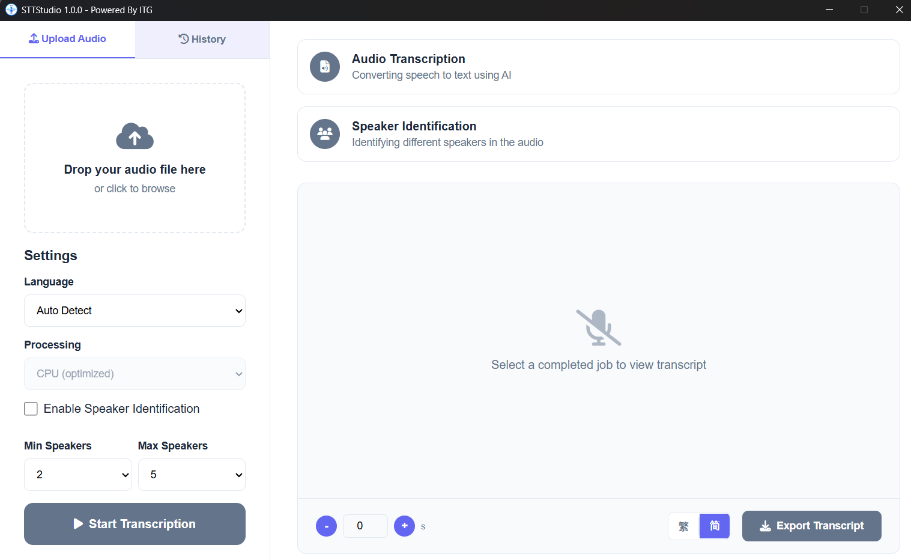

# X-Caption - Offline Speech Workspace

X-Caption is a lightweight speech-to-text studio that transcribes audio locally with Whisper.cpp. Models are downloaded on demand (with progress) the first time you generate captions, and optional noise suppression runs locally. A native PyWebView shell wraps the Flask backend so the whole experience feels like a desktop app.



## Highlights
- Whisper.cpp transcription: local, fast, and privacy-friendly.
- On-demand model downloads with progress UI (no bundled models required).
- Noise suppression (optional): RNNoise via FFmpeg `arnndn` (runs only during transcription; playback audio stays original).
- Persistent job history: results are stored in SQLite and restored after restarts.
- Single-instance desktop shell: double-launches reuse the existing window and exit gracefully.
- One-folder distribution: PyInstaller ships `X-Caption.exe` beside unpacked DLLs, Python runtime files, and resources.

## Requirements
- macOS (Apple Silicon) with Python 3.12
- 8 GB RAM (recommended)
- FFmpeg (Windows build is included under `ffmpeg/` and is wired automatically)
- Python dependencies from `requirements.txt`
- Node.js (only needed if you want to build the React UI from `ui/`)

Install the Python tooling once (Python 3.12 required on macOS):

```bash
python3.12 -m venv .venv312
.venv312\Scripts\activate
pip install -r requirements.txt
```

Note: On Linux/macOS use `source .venv312/bin/activate`.

## Project Structure
```
.
|-- assets/
|   |-- app_capture.png         # UI screenshot
|   `-- app_icon/               # Multi-resolution icons
|-- data/
|   |-- models/                 # Local models (not tracked by git)
|   |   |-- whisper/
|   |   `-- rnnoise/
|   |-- transcriptions/         # Persisted transcripts + exports
|   |-- uploads/                # Cached audio copies for playback
|   `-- logs/                   # Runtime logs and crash reports
|-- sample/                     # Warm-up audio and example clips
|-- ffmpeg/                     # Bundled FFmpeg build
|-- installer/
|   `-- windows/
|       |-- prepare_layout.ps1  # Stages dist output before packaging
|       `-- X-Caption.iss       # Inno Setup definition
|-- scripts/                    # UI + release build helpers
|-- ui/                         # React UI source
|-- static/                     # Bundled frontend assets (static/ui/app.js)
|-- templates/                  # HTML templates served by Flask
|-- native_config.py            # App paths/env setup
|-- native_history.py           # History helpers against the SQLite queue
|-- native_job_handlers.py      # Transcription workflow
|-- native_job_queue.py         # SQLite-backed job queue + worker threads
|-- native_web_server.py        # Flask app that backs the UI
|-- xsub_launcher.py            # Desktop launcher (PyWebView + single-instance guard)
`-- xsub_native.spec            # PyInstaller spec for the one-folder build
```

## Running in Development
1. Activate the virtual environment and install requirements (see above).
2. (Optional) Pre-download the Whisper model into `data/models/whisper/model.bin`:
   ```bash
   python model_manager.py --download
   ```
   Or skip this step and let the app download the model automatically the first time you generate captions.
3. Launch the app:
   ```bash
   python xsub_launcher.py
   ```
4. The launcher will start the backend on `http://127.0.0.1:11220`, open the PyWebView window, and block until shutdown.

### Offline runtime notes
- The packaged desktop build ships without models. Whisper models are downloaded on demand the first time you click **AI Generate Caption**.
- If the device is offline, download the Whisper model manually and place it at `data/models/whisper/model.bin` (or the user data models folder in production).
- Override the default model download URL or filename with `XCAPTION_WHISPER_MODEL_URL` and `XCAPTION_WHISPER_MODEL_FILE`.

### Frontend (React UI)
The React UI source lives in `ui/` and is built into `static/ui/` (served by Flask and bundled by PyInstaller).

Live dev (hot reload / HMR, no Python restart needed for UI changes):
```bash
python scripts/dev.py
```
If port `5173` is busy, the dev script will auto-pick the next free port. If you see "Another X-Caption instance is already running", close the existing app instance and re-run the command.

Build the UI for production (outputs to `static/ui/`):
```bash
python scripts/build_ui.py
```

Manual UI build (same as above):
```bash
cd ui
npm install
npm run build
```
Then run `python xsub_launcher.py` as usual.

## Building the Production Executable
1. Install build deps:
   ```bash
   pip install -r requirements.txt
   pip install pyinstaller
   ```
2. Build everything (UI + PyInstaller) in one command:
   ```bash
   python scripts/build_release.py
   ```

   Or, if you prefer manual steps: rebuild the React bundle first:
   ```bash
   cd ui
   npm install
   npm run build
   cd ..
   ```
3. (Optional) Update `icon.ico` if you change the artwork in `assets/app_icon/`.
4. Build the one-folder executable:
   ```bash
   python -m PyInstaller xsub_native.spec --clean --noconfirm
   ```
5. The result is `dist/X-Caption/` with `X-Caption.exe` plus `_internal/` support files. Distribute the entire directory together.

## Preparing the Windows Installer
1. Stage the PyInstaller output and documentation:
   ```powershell
   powershell -ExecutionPolicy Bypass -File installer\windows\prepare_layout.ps1
   ```
   This copies `dist\\X-Caption\\` into `build\\windows\\stage\\` (ignored by Git).
2. Build the installer with Inno Setup:
   ```powershell
   installer\\windows\\InnoSetup6\\ISCC.exe installer\\windows\\X-Caption.iss
   ```
   The generated `X-Caption-Setup.exe` sits next to the `.iss` file and installs into `C:\\Users\\{Users}\\AppData\\Local\\Programs\\X-Caption` with optional shortcuts.

## Feature Rundown
- Single-process guard (mutex on Windows, file lock elsewhere) prevents accidental double launches.
- Job queue stored in `jobs.db` (SQLite) with status metadata, results, and activity timestamps.
- History API (`/history`) feeds the UI with persisted jobs, restoring filenames/audio for playback.
- `/job/<id>` GET/DELETE endpoints return results or remove all persisted artifacts (uploads, transcripts, temp files, `jobs.db` row).
- Two worker threads by default (`start_worker(num_threads=2)`) for faster batch throughput.
- UI polling keeps bundle size minimal yet retains live progress updates.

## Processing Flow
```mermaid
flowchart LR
    upload[User uploads audio] --> server[Flask web server]
    server --> queue[SQLite job queue]
    queue --> workers[Worker threads]
    workers --> ns{Noise suppression enabled?}
    ns -- Yes --> denoise[RNNoise (FFmpeg arnndn)]
    ns -- No --> stt[Whisper.cpp transcription]
    denoise --> stt
    stt --> history[Write transcripts and update history]
    history --> storage[Persist results and history metadata]
    storage --> ui[UI polling and job cards]
    history --> downloads[Provide downloads in JSON, TXT, and audio]
```

## License
Copyright (c) China CITIC Bank International.
This project author is Billy YT Sin; see the accompanying [LICENSE](LICENSE) for details.
